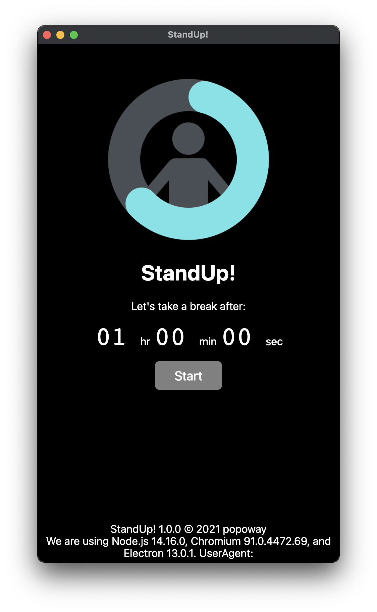

# StandUp!

<div align="center"></div>


[](https://github.com/popoway/stand-up/actions/workflows/codeql-analysis.yml)
[](https://github.com/popoway/stand-up/releases)

[](https://popoway.mit-license.org/)  

Built with Electron, StandUp! is a cross-platform MVP app to remind you to take a break from the screen when the timer is due, via native notification.

## Table of Contents

- [Description](#description)
- [Status](#status)
- [Building](#building)
- [Contributing](#contributing)
- [License](#license)


## Description

Inspired by the ambivalence about text editors (Atom vs VSCode) when I switched to M1 Mac, this project is created as a playground of the Electron framework behind both choices. The main goals are to practice how native APIs are incorporated into Node.js, and to inspect the Electron app deployment pipeline.

<div align="center"></div>

Prebuilt macOS x86_64 (Intel) and arm64 (Apple Silicon) binaries are available [here](https://github.com/popoway/stand-up/releases).

## Status

This project is currently under development and will be updated occasionally.

## Building

1. Prerequisites: `git` and `node`
2. `git clone https://github.com/popoway/stand-up.git` to get the code
3. `npm install` to install dependencies

To run the desktop (electron) app without building an installer, start the app with:

```bash
npm start
```

To build desktop apps targeted for the current host, use this npx, and the results can be found in `./out`:
```bash
npx electron-forge make
```

## Contributing

[Open a pull request](https://github.com/popoway/stand-up/pulls) for your ideas on how this project can be improved. 

To report a security vulnerability, please review the [Security Policy](https://github.com/popoway/stand-up/blob/main/SECURITY.md).

## License
[MIT](https://popoway.mit-license.org/)
